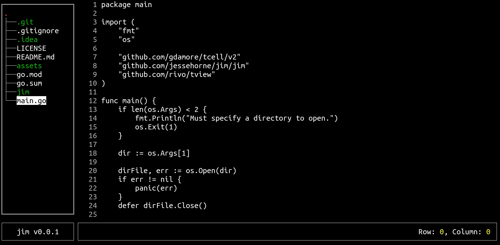

jim
===

A simple terminal-based code editor written in Go.

**Lots to do. Stay tuned.**



# Usage

```shell
go run main.go PATH_TO_DIRECTORY
```

# Contributing

* Create tickets if you find bugs or want to suggest a feature. You'd be surprised how quick I will act on suggestions.
* Feel free to fork and submit PR's
* Let me know if you're using it :-)

